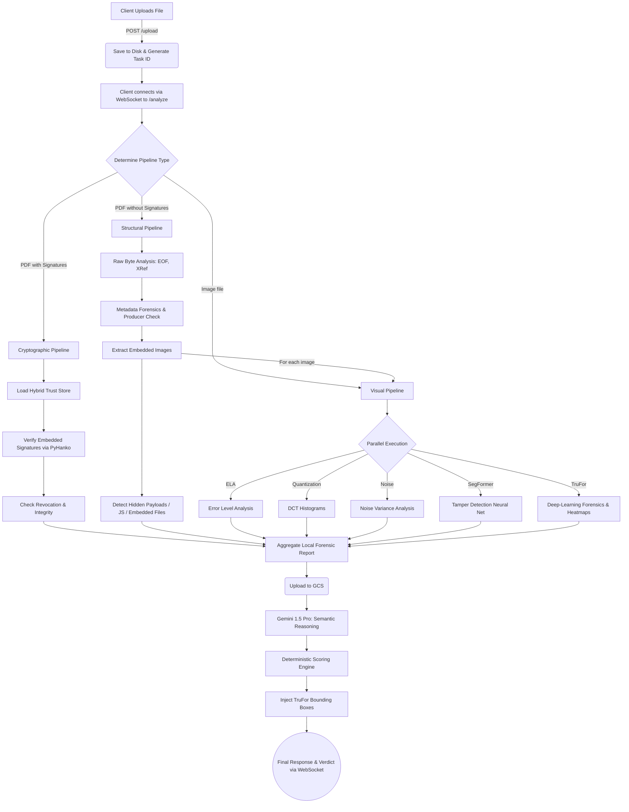

# VeriDoc Forensic Engine: Deep Scan Architecture

This document outlines the architecture, pipeline flow, and technical details of the **Deep Scan** feature (VeriDoc Forensic Engine) within EntropyShield. The Deep Scan feature is responsible for analyzing uploaded policy documents and images for structural tampering, visual splicing, and cryptographic integrity.

## 🌊 Pipeline Orchestration Flowchart

Below is the overarching flowchart describing how the Deep Scan orchestrates different forensic pipelines depending on the uploaded file type.

## 🛠️ Deep Scan Pipelines

The deep scan feature implements three major pipelines that handle different types of forensic analysis asynchronously, ensuring high throughput and non-blocking I/O.

### 1. Structural Pipeline (`analyze_structural`)
Analyzes native PDFs for underlying structural anomalies.
* **Incremental Update Detection**: Checks for multiple `%%EOF` markers and `xref` keywords which indicate a file was modified after its initial creation.
* **Metadata Consistency**: Validates the `/Producer` metadata for suspicious PDF generators (like *Phantom* or *GPL Ghostscript*).
* **Embedded Image Extraction**: Extracts images embedded within the PDF and recursively runs the **Visual Pipeline** on them. This ensures pasted signatures or faked screenshots are caught.
* **Malware & Hidden Content**: Scans for embedded JavaScript (`/JS`), auto-execution actions (`/OpenAction`), and hidden embedded files that might contain payloads.

### 2. Visual Pipeline (`analyze_visual`)
Performs pixel-level and deep-learning forensics on images or extracted PDF images. It runs multiple analysis tasks concurrently:
* **Error Level Analysis (ELA)**: Resaves the image at a known JPEG quality and computes the absolute difference to highlight spliced regions with differing compression levels.
* **Noise Analysis**: Computes a block-wise noise variance map to detect inconsistent high-frequency noise.
* **Quantization Checks**: Analyzes DCT histograms and zero-bin gaps as a proxy for double quantization artifacts.
* **SegFormer**: Semantic segmentation neural network (Transformer-based) optimized for detecting digital forgery patterns with high confidence.
* **TruFor**: Heavyweight deep-learning forensics that generates detailed heatmaps and bounding boxes marking manipulated pixel boundaries.

### 3. Cryptographic Pipeline (`analyze_cryptographic`)
Evaluates the authenticity of digitally signed PDFs.
* **Hybrid Trust Store**: Loads Mozilla and local trust stores to establish a robust validation context.
* **Signature Validation**: Uses `pyhanko` to verify if digital signatures are intact (not altered post-signing), trusted (known root certificate), and not revoked.
* **Legacy Crypto Detection**: Flags weak encryption keys or hashes used in the signing process, which might indicate a forged or insecure signature.

## 🧠 Scoring & Verdict Engine
The final step takes the raw results from the orchestrator, sends them via the cloud, and fuses them into a structured verdict:
1. **AI-Reasoning Phase**: Local reports and the document are fed into Gemini 1.5 Pro via a Google Cloud Storage URI to generate a contextual summary.
2. **Deterministic Scoring**: The `scoring_engine.py` calculates a deterministic authenticity score combining the structural/visual local penalties and the AI reasoning baseline.
3. **Bounding Boxes**: For visual forensics, the TruFor heatmap is processed, and coordinate bounding boxes for tampered regions are mapped into the final response payload for rendering on the front-end Visual Lab component.
